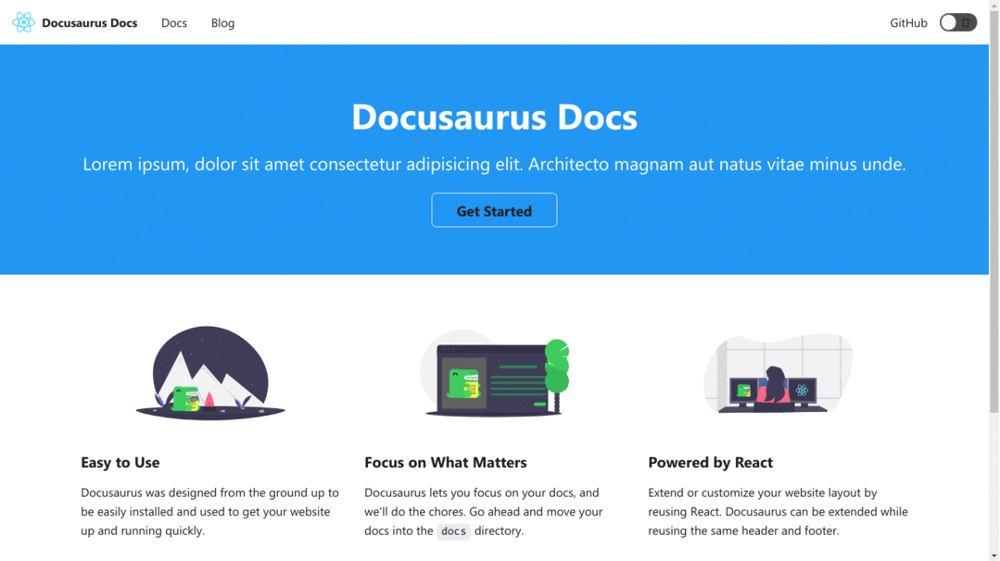

# Docusaurus Docs

> Sample Documentation Website built with docusaurus

<h2 align="center">
  
  <br>
</h2>


## Quick Start

```bash
# Install dependencies
npm install

# Run in development mode
npm start

# Run in production mode
npm run build
npm run serve
```
